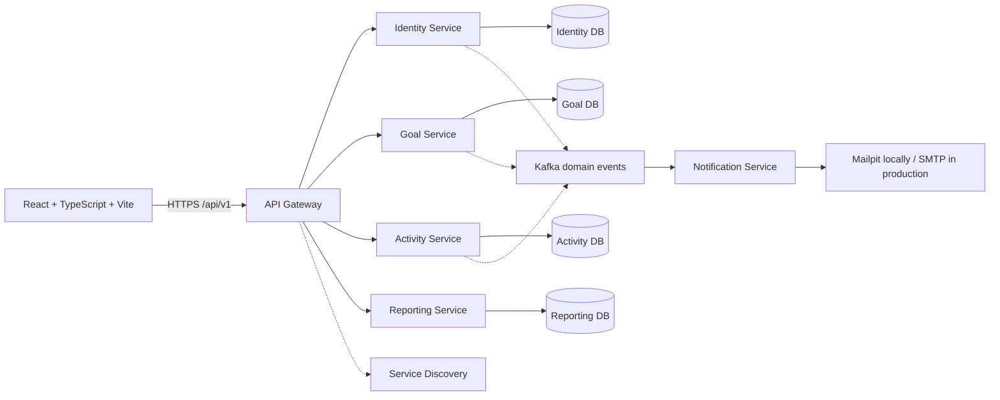

# Progressly

Progressly is a multi-user personal progress platform for custom goals, daily activities, habits, measurable progress, reports, and insights. It is being built as a set of independently deployable Spring Boot microservices behind an API gateway. Authentication, goals, milestones, and task APIs are now implemented; remaining product modules and frontend workflows are still in progress.

> Current status: Phase 1 — microservices project initialization. Infrastructure and the frontend shell are in place; business services are being scaffolded next.

## Features planned

- Custom goals, milestones, tasks, recurring activities, and habits
- Boolean, numeric, count, percentage, and duration tracking
- Dashboard, calendar, analytics, streaks, achievements, journal, and reports
- Secure JWT authentication with USER and ADMIN roles
- User-owned import/export, backup/restore, reminders, email, and audit logs
- PostgreSQL, Redis, Kafka, Mailpit, Docker Compose, automated tests, CI/CD, and monitoring

## Architecture

Progressly uses domain-oriented microservices. The React client communicates only with the API Gateway. Services own their data and communicate synchronously through internal APIs only when necessary; Kafka carries domain events for notifications, reports, achievements, and analytics. PostgreSQL is provisioned per service boundary using separate databases or schemas, Redis is used for rate limiting and cache, and Eureka provides local service discovery.



## Repository structure

```text
progressly/
├── services/                # Independently deployable Spring Boot services
│   ├── api-gateway/
│   ├── service-discovery/
│   ├── identity-service/
│   ├── goal-service/
│   ├── activity-service/
│   ├── reporting-service/
│   └── notification-service/
├── frontend/                # React + TypeScript + Vite client
├── docs/                    # Architecture and operational guides
├── docker-compose.yml       # Local PostgreSQL, Redis, Kafka, Mailpit
├── .env.example
└── README.md
```

The service boundaries are documented in [docs/architecture.md](docs/architecture.md). No service may read another service's database directly. Cross-service workflows use APIs or Kafka events, with correlation IDs, retries, idempotency, and dead-letter handling.

## Prerequisites

- Git
- Java 21 JDK
- Maven 3.9+ (or Maven Wrapper once generated)
- Node.js 20+ and npm
- Docker Desktop with Docker Compose v2, or Podman Desktop with a working Compose provider

Verify the toolchain:

```bash
git --version
java -version
mvn -version
node --version
npm --version
docker compose version       # Docker
podman compose version       # Podman alternative
```

## Local setup

### One-command startup on Windows

After installing the prerequisites, run this from the repository root:

```powershell
.\scripts\start-local.ps1
```

The script creates `.env` if needed, starts container infrastructure using Docker or Podman, automatically initializes/starts the Podman machine when required, builds and starts all microservices, starts the frontend, waits for the expected ports, and prints a status table. Logs are written to `.progressly-local\logs`.

Use `-SkipBuild` for faster restarts:

```powershell
.\scripts\start-local.ps1 -SkipBuild
```

Stop the complete local environment with:

```powershell
.\scripts\stop-local.ps1
```

From the repository root:

```bash
Copy-Item .env.example .env                 # PowerShell
# cp .env.example .env                      # macOS/Linux
docker compose up -d
```

Start service discovery in a second terminal:

```bash
cd services/service-discovery
mvn spring-boot:run
```

Start the API gateway in a third terminal:

```bash
cd services/api-gateway
mvn spring-boot:run
```

Start the frontend in a fourth terminal:

```bash
cd frontend
npm install
npm run dev
```

Open `http://localhost:5173`. The gateway runs on `http://localhost:8080`, Eureka is at `http://localhost:8761`, Prometheus is at `http://localhost:9090`, and Mailpit is at `http://localhost:8025`. Each Spring service exposes Swagger UI at `http://localhost:<port>/swagger-ui.html` and Prometheus metrics at `http://localhost:<port>/actuator/prometheus`.

Windows users can use `mvn spring-boot:run` from each service directory. A Maven Wrapper will be added at the services root once the local Java toolchain is installed.

Stop local infrastructure with:

```bash
docker compose down
```

To remove local database/cache/event data as well, use `docker compose down -v` only when you intentionally want a clean local reset.

## Environment variables

Copy `.env.example` to `.env` for local infrastructure defaults. The backend reads database and port settings from environment variables. The frontend uses `VITE_API_BASE_URL`. Real credentials must never be committed; production values belong in the deployment provider's secret manager.

## Database and local infrastructure

Docker Compose provides PostgreSQL 16, Redis 7, Kafka in KRaft mode, and Mailpit. PostgreSQL, Redis, and Kafka use named persistent volumes. Health checks are included. See [docs/docker.md](docs/docker.md), [docs/database.md](docs/database.md), and [docs/email.md](docs/email.md).

## Testing

Service tests:

```bash
cd services
mvn test
```

Frontend tests and production build:

```bash
cd frontend
npm test
npm run build
```

## API documentation and metrics

The API is versioned under `/api/v1`. Swagger UI and OpenAPI JSON are available on each service at `/swagger-ui.html` and `/v3/api-docs`. Actuator exposes Prometheus-format metrics at `/actuator/prometheus`, and the local Prometheus server scrapes all service ports every 15 seconds.

## Delivery roadmap

1. Project initialization — current phase
2. Authentication, JWT refresh tokens, roles, and ownership checks (authentication slice in progress)
3. Goals, milestones, tasks, habits, and progress
4. Dashboard, calendar, analytics, streaks, and achievements
5. Reminders, scheduler, email, and weekly reports
6. Excel/CSV/PDF import, export, and backup/restore
7. Redis and Kafka integrations
8. Unit, integration, API, frontend, and security testing
9. GitHub Actions, metrics, logging, and monitoring
10. Vercel, Render, managed PostgreSQL/Redis/Kafka, and Grafana Cloud deployment

## Documentation

- [Local development](docs/local-development.md)
- [Architecture](docs/architecture.md)
- [Database plan](docs/database.md)
- [Docker and local services](docs/docker.md)
- [Deployment](docs/deployment.md)
- [Monitoring](docs/monitoring.md)
- [Kafka](docs/kafka.md)
- [Redis](docs/redis.md)
- [Email](docs/email.md)
- [Troubleshooting](docs/troubleshooting.md)
- [Security](docs/security.md)

## Future improvements

Authentication and the first user-owned goal/task vertical are next. Kubernetes, mobile clients, and AI features remain deferred until the microservices workflow is stable.
